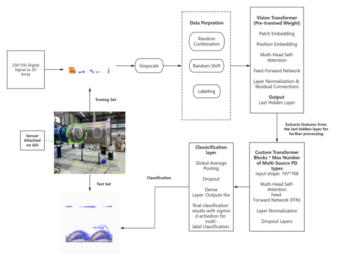
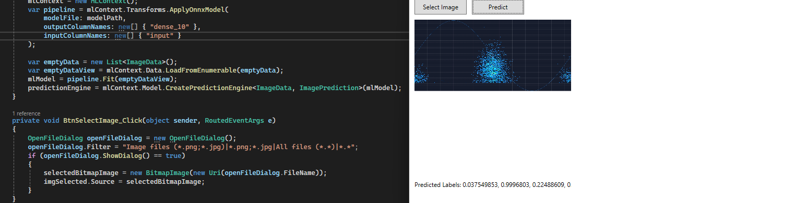

# Before you Start reviewing the Code

It is a simplified demo project based on a pre-trained ViT model by Google

Vision Transformer (ViT) model pre-trained on ImageNet-21k (14 million images, 21,843 classes) at resolution 224x224. It was introduced in the paper [An Image is Worth 16x16 Words: Transformers for Image Recognition at Scale](https://arxiv.org/abs/2010.11929) by Dosovitskiy et al. and first released in [this repository](https://github.com/google-research/vision_transformer). However, the weights were converted from the [timm repository](https://github.com/rwightman/pytorch-image-models) by Ross Wightman, who already converted the weights from JAX to PyTorch. Credits go to him. 

Key Concepts:
Partial Discharge (PD): An electrical discharge that does not completely bridge the space between two conducting electrodes. PD can indicate insulation defects, contamination, or other issues within electrical equipment.

Phase Resolved: PRPD patterns are resolved in relation to the phase angle of the applied alternating current (AC) voltage. This means the discharges are analyzed and displayed based on their occurrence within the AC cycle.

How PRPD Works:
Detection: Specialized sensors and measurement systems detect partial discharges occurring within the electrical equipment.

Phase Correlation: The detected discharges are correlated with the phase angle of the AC voltage. This involves recording the time of occurrence of each discharge relative to the AC cycle.

Pattern Visualization: The data is plotted on a two-dimensional graph with the phase angle on the horizontal axis (0° to 360°) and the discharge magnitude or intensity on the vertical axis. The resulting PRPD pattern provides a visual representation of discharge activity throughout the AC cycle.

Key Features of GIS:
High Insulation Performance:

SF6 Gas Insulation: SF6 gas provides excellent electrical insulation and arc-quenching properties, allowing for compact design and high voltage handling capabilities.
Compact Design:

Space Efficiency: GIS units are much more compact than traditional air-insulated switchgear (AIS), making them suitable for installation in confined spaces, such as urban substations.
Enhanced Safety and Reliability:

Reduced Risk of Fire: The sealed design and use of SF6 gas significantly reduce the risk of fire and explosion.
Environmental Protection: GIS systems are less susceptible to environmental conditions like pollution, humidity, and salt contamination.
Low Maintenance:

Durability: GIS equipment requires less maintenance compared to AIS due to its sealed construction and robust design.

Benefits of PRPD Patterns:
Diagnostic Insight: PRPD patterns help identify the type, location, and severity of insulation defects.
Condition Monitoring: Regular monitoring of PRPD patterns allows for early detection of potential insulation failures, facilitating proactive maintenance.
Improved Reliability: By addressing insulation issues early, PRPD patterns contribute to the overall reliability and longevity of high-voltage electrical equipment.
# Project Description
1. The Testing and Training folder is the PRPD pattern from real substations and Labs in GIS, single means the PRPD has only one type of PD source
2. The Mixture-image-maker.py is a script that combining the single source PDs into multi-source PDs. (Identifying the type of partial discharge (PD) is crucial for the stable operation of gas-insulated switchgear (GIS). Different types of PD can cause varying degrees of damage to the insulation. Correct identification helps in evaluating the insulation status and ensures timely and targeted maintenance actions to prevent failures and prolong equipment life). It applies random horizental shifts 
to simulate the Phase Shift(I recommend use GANs in real world application, but here is the demo project, which is show a pipeline/work flow that how the Hybrid model works). I have conduct experiments that proves we can simulate Multi-source PDs by combining Single-source PDs, this study will be published soon or later.

You will create thousands of traning data by running this script, a folder called ./Traning-combined-Images will be created.
testing-single-to-combine-images.py uses Testing-single-image can create a folder called ./Testing-combined-Images for testing

The model will use 80% data from ./Traning-combined-Images for training and 20% for validation, I use tensord board to visdualize the process.

#The Ultra-eval.ipynb will use images from ./Testing-combined-Images for testing, The idea is to show the generlization of the model, where the testing data use #different PRPDs that the model have never trained for.

3. 

4. Visualization-2 folder contains the outputs of each layer of the model, the idea is to give you a better understanding how this model structure use pre-trained model to extract features and enhance this features. 

5. Use ultra-with-visdual.py to train this model, the ultra-with-visdual-4*3072.py is a more complex model that combining the features of CNN into the training. 

6. The pre-trained model is too big to uploead, I download it from (https://huggingface.co/models?search=google/vit), 
 use model = ViTModel.from_pretrained('google/vit-base-patch16-224-in21k') rather than model = ViTModel.from_pretrained('./vit-base-patch16-224-in21k') in this repo

7. This device has a AMD graphic card, so I use directml to acc the traning process, another example will use Nvdia with Cuda cores.

8. A .h5 file and a .onnx file will be created after the training process, there is a section in Ultra-eval.ipynb that allow you to load the model through .h5 file and select PRPDs for classification.  I have also make a simple  .NET project that loead the .onnex file and have a UI to let user use it. 

9. The project is a simplified demo, the data is provided by "GLOBAL(Shanghai)Technology Co. Ltd" refer as "the company"
10. This repo is based on a reasearch will be published to IEEE. and I am the author.
11. The company will use model weight in software and online applications for users.
12. This repo can be set into private repo at anytime.
   
